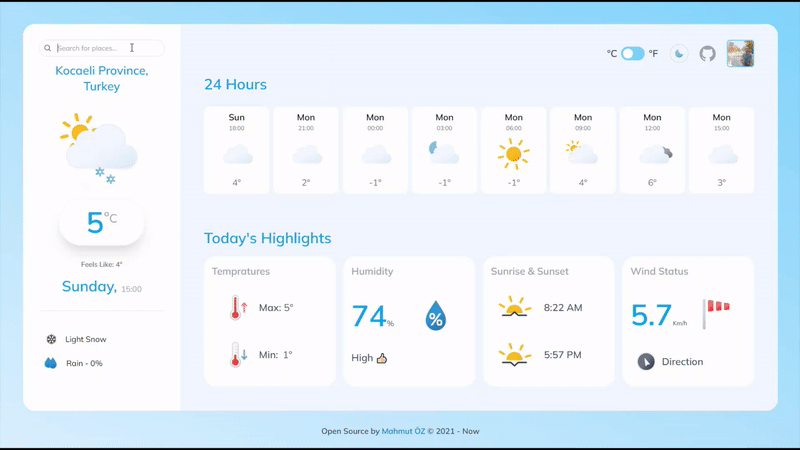

# Weather Forecast App 🌞



### [See it live](https://weather-forecast-react-application.netlify.app/) ↗

## Getting Started

- Sign up over at [openweathermap.org](https://openweathermap.org) and get an
  API key.
- Fork the project and clone it locally.
- Create a file at the root of the project called .env with the following
  contents:

```
REACT_APP_API_URL  = https://api.openweathermap.org/data/2.5
REACT_APP_API_KEY  = {Your api key}
REACT_APP_ICON_URL = https://openweathermap.org/img/wn/
```

In the project directory, you can run:

```cmd
yarn start
yarn run watch
```

## Icons

- [Weather-icon](https://basmilius.github.io/weather-icons/)
- [React icons](https://react-icons.github.io/react-icons/)
- [Openweathermap Icons](https://openweathermap.org/weather-conditions)
